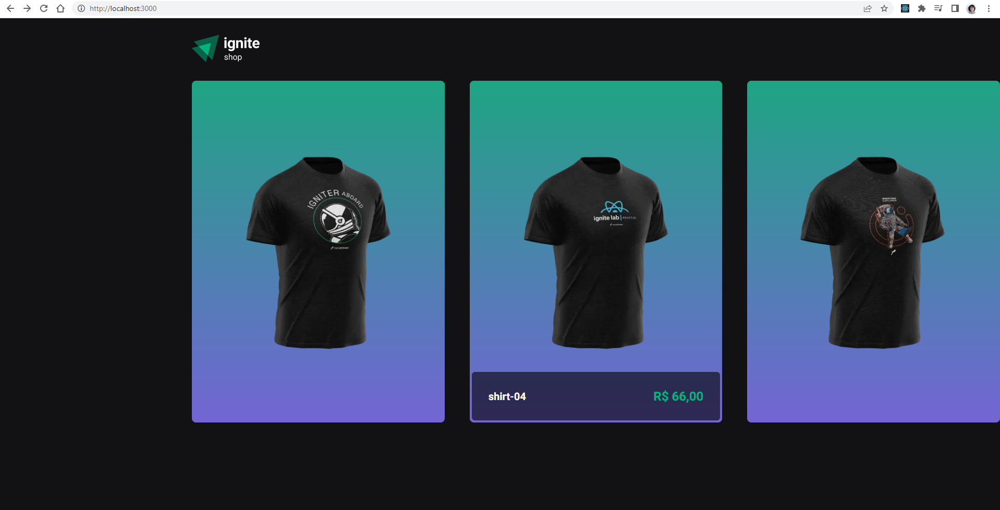
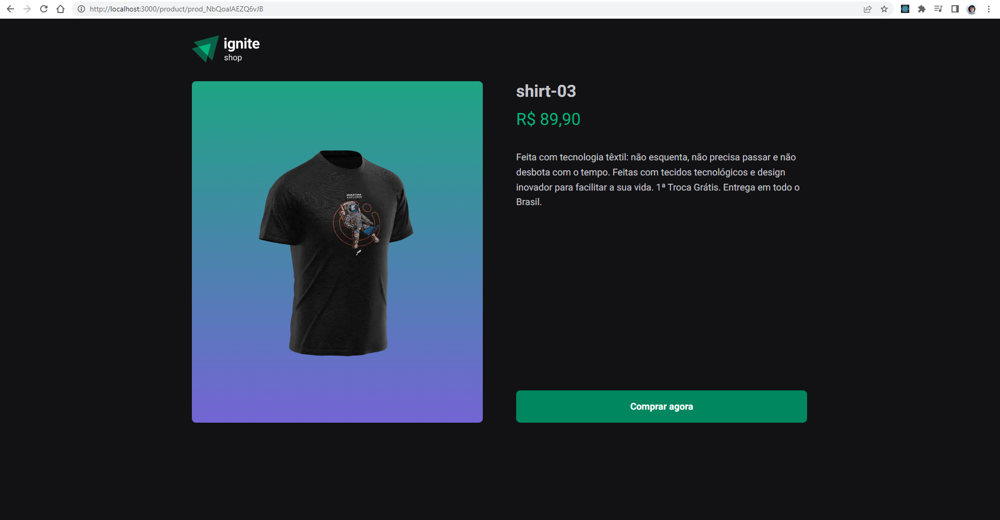
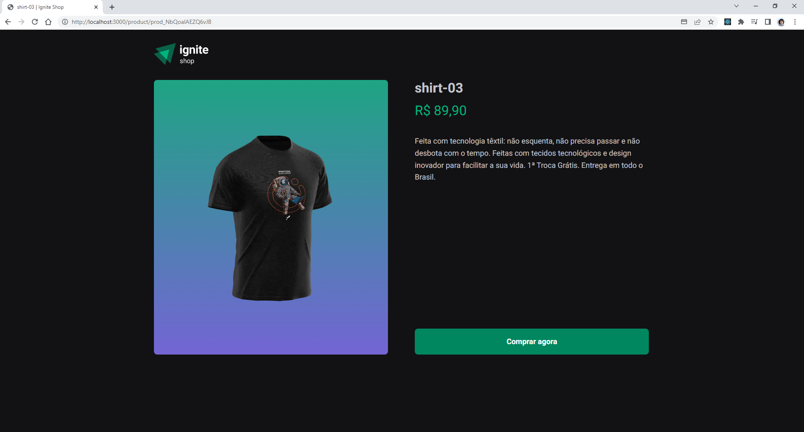
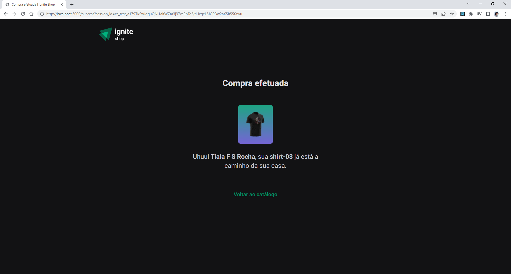

## Ignite Shop

First, run the development server:

```bash
npm run buil
# or
yarn buil
# then
npm start
# or
yarn start
```

### Ignite Rocketseat Project 04 - Next.js fundamentals

<p>
Application developed to study the creation of a complete project with the Next.js framework. Using StitchesJS, going through SPA's, server-side rendering (SSR) and static-site generation (SSG) concepts.
</p>

### Video:
 
</br>
### Images:


 



 

